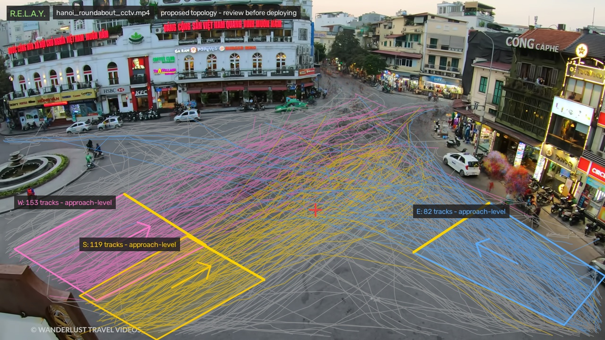
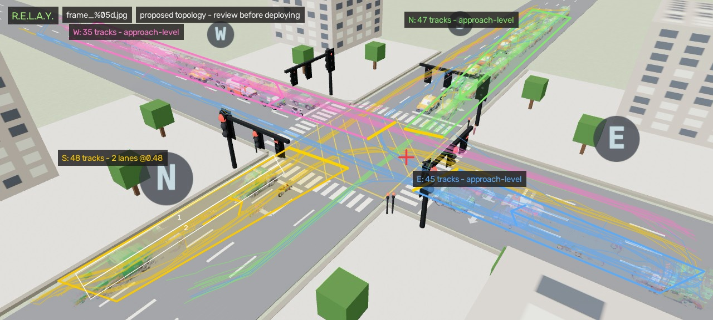

# R.E.L.A.Y.

**Real-time Evaluation of Lane Activity for Yield-control** - adaptive traffic-signal control that
never wastes a green on an empty lane.


Kathmandu's junctions run on fixed timers - blind to real traffic. A green stays on for an empty
approach while a packed one waits (up to ~200 seconds for two motorcycles). R.E.L.A.Y. watches the
junction through ordinary cameras, counts vehicles per approach with a single YOLO model, and
retimes the lights on demand: no green for empty lanes, more green where the queue is, nobody
starves, and an ambulance clears its own path.

## The proof, live

**Split-screen, identical traffic** - left runs today's fixed timer, right runs R.E.L.A.Y. Same
seeded arrivals, only the controller differs. The fixed side queues up; R.E.L.A.Y. flows:


**The same system on real footage** - a real motorcycle-heavy junction (Hanoi, fixed camera), read
live by the same pipeline: detections, per-approach demand, and the signal decision in the header:


**Any junction shape** - topology is config, not code. Same brain runs 4-way, 3-arm (T), 2-arm:


**A whole arterial, not one light** - `network.html` runs three signals on one street (T · 4-way · T
at short spacing). Each junction runs its own controller and subtracts its neighbour's downstream
queue from its own pressure, so a backed-up block upstream stops being fed into the jam. The
ambulance button preempts each junction in sequence: a green wave down the corridor.


## How it works - one brain, two eyes, one screen

- **Perception:** one YOLO model reads a fixed junction camera → per-approach, per-class vehicle
  counts (PCU-weighted, so a bus ≠ a motorcycle).
- **The junction calibrates itself:** approach zones come from clustered vehicle trajectories, lanes
  from the road paint, and both land in a config file a person reviews before it goes live
  ([auto-calibration](#auto-calibration-lanes-and-approaches)).
- **Control:** queue-weighted **max-pressure** - `score(phase) = PCU-demand × (1 + wait/max_wait)
  + ped-pressure + emergency-boost` - with empty-phase skip, gap-out, min/max-green, yellow + all-red clearance,
  hard anti-starvation, and emergency preemption. Every safety invariant is asserted by a runnable
  self-check (`src/controller.py`).
- **It measures the junction. Nothing is configured per site.** A queue on red can only grow, so its
  growth is the arrival rate; on green, departures are that rate minus the observed change. Those two
  numbers decide how long each green runs (its share of Webster's cycle at the *measured* saturation)
  and how far a rival phase must be ahead to take it (the discharge those 4.5s of clearance would throw
  away). No saturation-flow table, no traffic survey, nothing to calibrate on install. This is the part
  that makes it work when the junction fills up: a plain max-pressure rule ends every green at the 5s
  floor at saturation and loses to a fixed timer outright.
- **Pedestrians are demand, not decoration:** people waiting to cross add pressure to the phase
  that would give them a walk window, no one waits past `ped_max_wait`, and a walk is never cut
  while someone is still on the zebra. (Lalitpur's system times vehicles only.)
- **Two eyes, one detector:** the *same* model reads **real CCTV** and a **synthetic live feed** - a Three.js junction endlessly generating random Kathmandu-style traffic. The sim doubles as a
  free, perfectly-labeled dataset (it knows every vehicle's exact box), and mixing those auto-labels
  with pseudo-labeled real frames trains **one detector for both domains** - it even learns to
  visually recognize ambulances.
- **The loop is closed:** browser streams rendered frames → server runs YOLO → controller picks the
  phase → signals return → the sim's cars obey → repeat, in real time.

## Quickstart

```bash
python3 -m venv .venv && .venv/bin/pip install -r requirements.txt

# LIVE closed loop (YOLO drives the signals):
.venv/bin/python tools/live_server.py
# → http://127.0.0.1:8000/?live=1            4-way, live detection + adaptive control
# → http://127.0.0.1:8000/?live=1&topo=T     3-arm T junction
# → http://127.0.0.1:8000/compare.html         fixed-vs-adaptive split screen
# → http://127.0.0.1:8000/network.html         3-signal arterial + ambulance green wave
# → http://127.0.0.1:8000/real.html            real CCTV clip through the same pipeline
#     (drop any static junction video at sim/footage/real.mp4 - clips aren't shipped)

# checks
.venv/bin/python src/controller.py    # safety + fairness invariants
.venv/bin/python src/lanes.py         # lane detection: finds lanes on paint, none without it
.venv/bin/python src/calibrate.py     # junction auto-calibration on synthetic traffic
.venv/bin/python src/microsim.py      # adaptive-vs-fixed benchmark on identical arrivals

# the fine-tuned detector ships with the repo (dataset/runs/ft_mixed/weights/best.pt, 5MB) - # live detection works on a fresh clone. To rebuild it from scratch (optional, ~20 min on Apple Silicon):
# 1) auto-labeled sim frames:   open http://127.0.0.1:8000/?capture=300
# 2) pseudo-label real frames:  .venv/bin/python tools/pseudo_label.py <frames_dir>
# 3) train mixed:               .venv/bin/python tools/train.py 25 640 mps ft_mixed
```

## Measured results - what each number is (and is not)

| Setting | Result | Nature |
|---|---|---|
| **vs a properly timed fixed plan** - Webster cycle + splits from the true mean demand, 30 seeds/cell (`paper/experiments/exp1_single_junction.py`) | **28–44% less delay, every cell** | the honest headline. Webster is given perfect knowledge of average demand, which no real installation has |
| **vs an equal-split timer** (same runs) | 28–96% less delay | the baseline most camera-based papers use; easy to beat, so it isn't the headline |
| **Per-vehicle waits** (asymmetric, 1278 veh/h) | p95 14.5s vs 25.8s · worst 26.7s vs 50.1s | fairness, not just throughput - the tail numbers means-only benchmarks never report |
| **Every demand shape and topology** - 72 cells, 7 shapes, 4-way + T, to 2462 veh/h (`exp6_robustness.py`) | **beats both baselines in 71 of 72**; worst cell vs equal-split still +26% | the one loss is an approach wanting 82% of all green, where the 60s fairness bound forbids a stable cycle and Webster wins by ignoring it |
| **With a 20% miscounting detector** (same 72 cells) | unchanged: 71 of 72 | the estimators average over 60s, so count noise doesn't reach the decisions |
| **Corridor**, 3 signals (`exp2_corridor.py`) | 45–58% less delay, ambulance crosses in 22–28s vs 30–54s | coordination term contributes ~0 (see below) |
| **Ambulance to green** - 900 trials (`exp3_preemption.py`) | 4.09s mean, 13.99s worst against a 14.0s analytical bound | the bound is arithmetic from clearance + min-green, so it can be quoted to a fire service |
| **Live interactive demo** - toggle R.E.L.A.Y. ON/OFF and measure on screen | typically 10–35% fewer queued (varies with the traffic you spawn) | measured live from the scene you're watching |
| **Detector, synthetic held-out frames** | mAP@50 ≈ 0.88, precision 0.96 | synthetic-domain only |
| **Detector, real footage** | cars: strong; dense two-wheeler swarms: undercounts (improves at `--imgsz 960`) | known limitation - regional fine-tune is the fix, documented below |
| **Controller invariants** | all pass: clearance, empty-skip, min-green, no-starvation, preemption | asserted by `src/controller.py` |

Two things the numbers say that don't flatter the design, kept here because they're in the paper:
the corridor coupling term (each junction subtracting its neighbour's queue) changes delay by under
1%, so the corridor gain is local adaptivity and not coordination; and the point-queue model can't
produce the spillback that term exists to prevent, so it's unproven rather than disproven.

*(Local anchor: measured studies of signalised intersections in the Kathmandu valley report
saturation flows and delays well away from standard capacity guidance, and put the difference down
to the local vehicle mixture and lane discipline. That is the condition under which a fixed plan
copied from a design manual performs worst. Shrestha & Marsani, "Development of saturation flow and
delay model at signalised intersection of Kathmandu", IOE Graduate Conference, 2014; Nepali et al.,
"Assessment of traffic characteristics at major urban road intersection of Kathmandu valley",
Journal of Civil and Construction Engineering 10(1), 2024.)*

## Repository layout

```
sim/                the synthetic live junction (Three.js)
  main.js           live feed · ?live=1 closed loop · ?capture=N auto-labels · ?topo=4|T|2
  peds.js           pedestrians: spawn, wait at the zebra, cross on walk
  compare.html      split-screen fixed-vs-adaptive: live verdict + controlled server benchmark
  network.html      three signals on one arterial - coordination + ambulance green wave
  real.html         a real CCTV clip through the same WS/YOLO/controller pipeline (stock model)
  assets/models/    CC0 / CC-BY 3D vehicles
src/
  controller.py     weighted max-pressure controller (+ invariant self-check)
  perception.py     YOLO frame → per-approach and per-lane, per-class PCU counts
  lanes.py          road paint → lane polygons per approach, with a confidence (+ self-check)
  calibrate.py      vehicle trajectories → a proposed junction topology (+ self-check)
  pipeline.py       camera/clip → perception → controller, end to end
  microsim.py       adaptive-vs-fixed benchmark on identical arrivals
tools/
  autocalibrate.py  watch a junction for a warmup window → topology config + review preview
  live_server.py    FastAPI + WebSocket: YOLO on streamed frames → signals back
                    (also serves POST /save, so capture mode writes training frames here too)
  pseudo_label.py   label real CCTV frames with stock YOLO (free real-domain labels)
  train.py          fine-tune YOLO (sim-only or mixed)
  detect.py         run YOLO on an image, report vehicle detections
  camera_demo.py, draw_zones.py, verify_labels.py   webcam demo · zone setup · label QA
paper/
  main.tex/.pdf     the write-up: method, experiments, limitations
  experiments/      every number in it, as a runnable script + the raw CSVs it wrote
docs/               research synthesis · design spec · 96-case edge-case register
```

The paper is [`paper/main.pdf`](paper/main.pdf). Every figure and table in it comes from
[`paper/experiments/`](paper/experiments/) run against a clone of this repo - nothing in it is
estimated or copied from this README.

## Auto-calibration: lanes and approaches

Topology is still config, not code. This writes the first draft of that config by watching the
camera: no clicking, no training, no per-site labels.

```bash
.venv/bin/python tools/autocalibrate.py <camera-or-clip> myjunction.json --warmup 240
#   -> myjunction.json  zones + lanes + everything it measured
#   -> myjunction.jpg   the same thing drawn on the road, for review
.venv/bin/python src/pipeline.py <camera-or-clip> --zones myjunction.json
```



*Three minutes of the Hanoi clip: 879 trajectories, 677 usable, three approaches (coloured per arm,
grey is what the clustering threw away), junction centre as the red cross, stop lines in amber.
Ten outbound streams were rejected as exits and two more zones were dropped for landing on asphalt a
busier zone already had. There is no paint on this apron, so all three count at approach level.*

**Approaches from trajectories** (`src/calibrate.py`). Every detection goes through a small
predictive centroid tracker, and trajectories that travel the same road the same way cluster into
one approach: heading within 30 degrees, and within about a lane width of the cluster's axis line.
Where a vehicle happened to be first detected is deliberately not part of that test, so a queue tail
far back joins its own approach. The junction centre is the least-squares intersection of the
approach axes; it sets the stop-line setback, and each zone is that arm's own traffic from the 4th
to the 96th lateral percentile, upstream of the setback. Streams that only ever move away from the
centre are exits and get dropped, because a green for an exit is worse than a green for an empty
lane. Where two proposed zones land on the same asphalt the busier one wins: over-splitting one
approach is harmless, but merging two conflicting streams into one zone would hand them a shared
green, so the clustering stays conservative on purpose. Each approach also reports its observed turn
split, which is what decides whether an arm deserves a protected left of its own.

**Lanes from paint** (`src/lanes.py`). Classical CV, picked for explainability: a median road plate
over the warmup window (moving vehicles average away, paint stays), a top-hat ridge filter and a
white/yellow colour gate for the markings, Hough segments filtered to the flow direction, a RANSAC
vanishing point, then lateral offsets clustered into lane boundaries. Out comes a polygon per lane
plus a confidence built from four things you can go and measure: paint support, spacing regularity,
vanishing-point agreement, and how crisp the paint is. A zebra crossing's stripes also run with the
traffic, so the minimum-lane-width rule folds a whole crossing into one boundary rather than
eight lanes. An edge line is the first marking a road loses, so where the carriageway continues past
the outermost painted line the kerb lane is extrapolated (that extrapolation keeps the vanishing
point exactly, and the lane is flagged as inferred rather than seen).

The synthetic feed renders its own lane paint, which makes it the one junction here with ground
truth: two lanes per direction, marked with a centreline and one divider, no edge lines. Point the
calibrator at frames captured from it (`?capture=N`) and it proposes all four approaches, then reads
exactly 2 lanes on the approach whose zone came out wide enough to hold them. The other three zones
came back too thin to fit paint into and count at approach level.



*The synthetic feed, same tool, same 22 seconds of traffic: 376 trajectories, four approaches, and
the two lanes of the near carriageway picked out of the paint (white, bottom left).*

**Per-lane queues, unchanged safety logic.** Each lane carries its own PCU queue. On that synthetic
approach the two lanes read 0 and 7.0 PCU at the same instant, with 68% of the approach's detections
landing inside a lane: six vehicles in one lane and six across three discharge very differently, and
an approach total cannot tell them apart. What the controller consumes does not change, so every
safety invariant still holds and `src/controller.py` still passes untouched. Lanes sharpen what the
camera reports; they do not rewrite what the signal logic is allowed to do.

**Honest limits.**

- Lane detection needs visible markings. On the Hanoi roundabout apron there is no paint, confidence
  reads 0.00, and the run counts at approach level instead. That fallback is the designed answer,
  not a failure, and `lane_coverage()` reports how much of an approach's traffic actually landed
  inside a lane so you can tell the difference.
- The road plate needs the asphalt visible in most of the samples it averages. On the Dhaka and HCMC
  clips the traffic never clears, so the median is a smear of vehicles rather than a road, and that
  smear is long and collinear enough to fit a lane line: it scored 0.86 until paint crispness (the
  median top-hat ridge, 85 to 124 on real markings against 15 to 16 on smear) joined the confidence.
  Those clips now say "markings too soft to be paint" and count at approach level.
- Auto-calibration needs a warmup window with traffic on every arm. An arm nobody uses does not
  exist as far as the proposal is concerned, and ten minutes of the boulevard clip fitted it much
  better than four did. Compass keys are phase names, assigned by best overall alignment rather than
  first come first served, and on a camera whose streets all run diagonally the residual is still
  large: 13 to 27 degrees on the boulevard, 41 to 45 on the Hanoi roundabout. Every approach carries
  its own error in the config, and anything past 35 degrees prints as a warning to check by hand.
- It proposes, you deploy. Read the preview, edit the JSON, and keep `tools/draw_zones.py` for the
  cameras where clicking four polygons is simply faster.

Both modules carry the same kind of runnable self-check as the controller: `python src/lanes.py`
asserts that a marked road yields lanes and that bare asphalt yields none, and
`python src/calibrate.py` asserts that synthetic 4-way traffic comes back as N/S/E/W with the exits
rejected, no two zones sharing asphalt, and the emitted config building a real controller topology.

## Deploying on a new junction - no training required

One shared detector serves every real camera (vehicles look the same everywhere; the general
model needs zero per-site training - verified on Thailand and Hanoi junctions unseen
during development). Per junction, setup is one minute:

```bash
.venv/bin/python tools/autocalibrate.py <camera-or-clip> myjunction.json   # watch the traffic
.venv/bin/python tools/draw_zones.py <camera-or-clip> myjunction.json      # or click the zones
.venv/bin/python src/pipeline.py <camera-or-clip> --zones myjunction.json
```

Optional, once per region (not per junction): fine-tune on local traffic (e.g. South-Asian
datasets) to sharpen motorcycle detection city-wide with a single set of weights. The only
training this repo does is for the synthetic feed, whose rendered look isn't in COCO.

## Honest scope

Working prototype with a credible pilot path - not a deployed product. Signal timing is one proven
lever on Kathmandu congestion, not the whole answer. Real CCTV clips used in development are
third-party and not redistributed here.

## Credits

3D models: Kenney Car Kit (CC0), Poly Pizza bus/motorcycle/scooter (CC-BY 3.0), Quaternius
pedestrian (CC0) - see [ATTRIBUTION.md](ATTRIBUTION.md).

## License

GNU AGPL-3.0 - see [LICENSE](LICENSE). The detector is built on Ultralytics YOLO, which is itself
AGPL-3.0, so this repo inherits the same terms. 3D assets keep their own licenses (see above).
