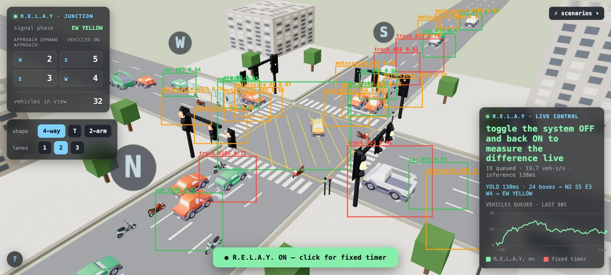
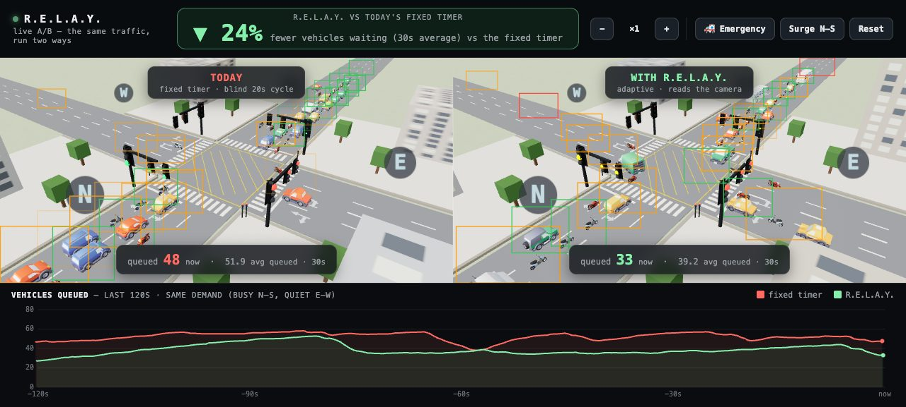
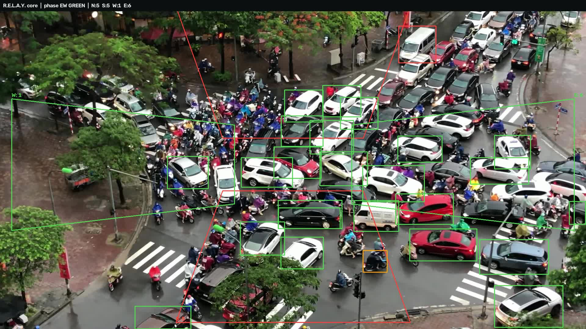
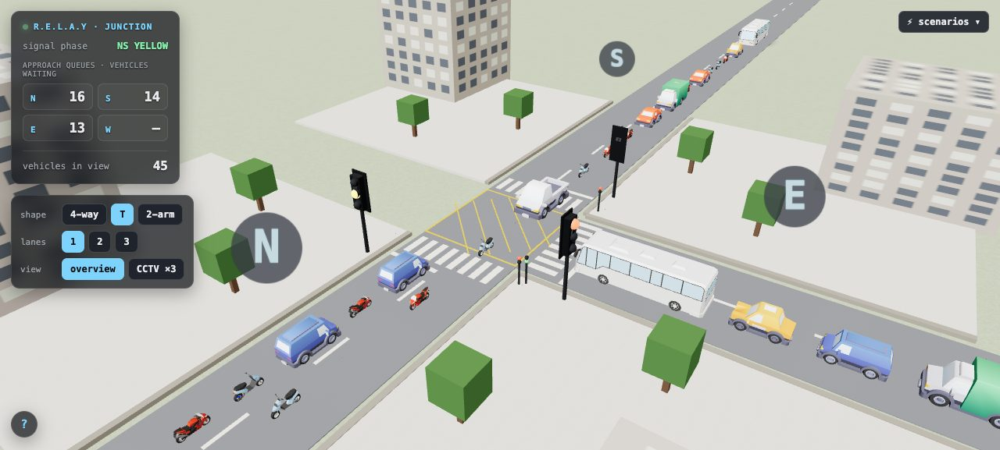
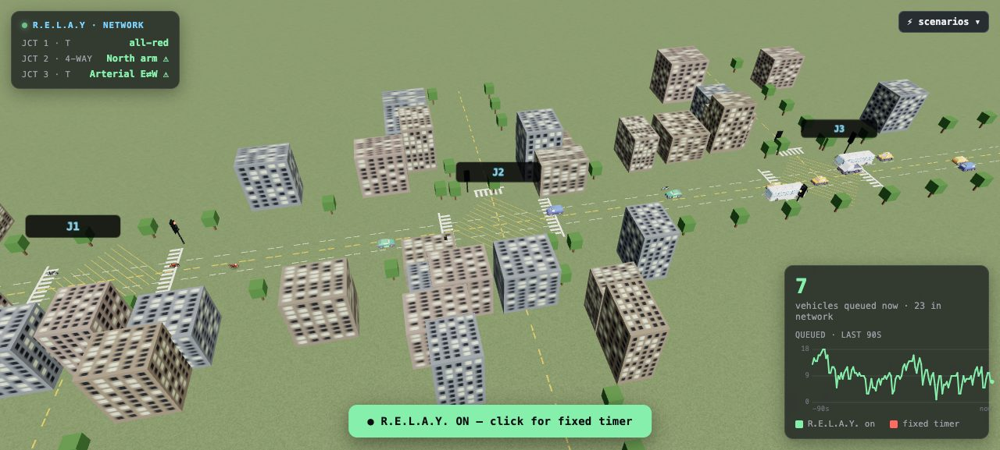

# R.E.L.A.Y.

**Real-time Evaluation of Lane Activity for Yield-control** — adaptive traffic-signal control that
never wastes a green on an empty lane.



Kathmandu's junctions run on fixed timers — blind to real traffic. A green stays on for an empty
approach while a packed one waits (up to ~200 seconds for two motorcycles). R.E.L.A.Y. watches the
junction through ordinary cameras, counts vehicles per approach with a single YOLO model, and
retimes the lights on demand: no green for empty lanes, more green where the queue is, nobody
starves, and an ambulance clears its own path.

## The proof, live

**Split-screen, identical traffic** — left runs today's fixed timer, right runs R.E.L.A.Y. Same
seeded arrivals, only the controller differs. The fixed side queues up; R.E.L.A.Y. flows:



**The same system on real footage** — a real motorcycle-heavy junction (Hanoi, fixed camera), read
live by the same pipeline: detections, per-approach demand, and the signal decision in the header:



**Any junction shape** — topology is config, not code. Same brain runs 4-way, 3-arm (T), 2-arm:



**A whole arterial, not one light** — `network.html` runs three signals on one street (T · 4-way · T
at short spacing). Each junction runs its own controller and subtracts its neighbour's downstream
queue from its own pressure, so a backed-up block upstream stops being fed into the jam. The
ambulance button preempts each junction in sequence: a green wave down the corridor.



## How it works — one brain, two eyes, one screen

- **Perception:** one YOLO model reads a fixed junction camera → per-approach, per-class vehicle
  counts (PCU-weighted, so a bus ≠ a motorcycle).
- **Control:** weighted **max-pressure** — `score(phase) = PCU-demand + w_wait · oldest-wait +
  emergency-boost` — with empty-phase skip, gap-out, min/max-green, yellow + all-red clearance,
  hard anti-starvation, and emergency preemption. Every safety invariant is asserted by a runnable
  self-check (`src/controller.py`).
- **Pedestrians are demand, not decoration:** people waiting to cross add pressure to the phase
  that would give them a walk window, no one waits past `ped_max_wait`, and a walk is never cut
  while someone is still on the zebra. (Lalitpur's system times vehicles only.)
- **Two eyes, one detector:** the *same* model reads **real CCTV** and a **synthetic live feed** —
  a Three.js junction endlessly generating random Kathmandu-style traffic. The sim doubles as a
  free, perfectly-labeled dataset (it knows every vehicle's exact box), and mixing those auto-labels
  with pseudo-labeled real frames trains **one detector for both domains** — it even learns to
  visually recognize ambulances.
- **The loop is closed:** browser streams rendered frames → server runs YOLO → controller picks the
  phase → signals return → the sim's cars obey → repeat, in real time.

## Quickstart

```bash
python3 -m venv .venv && .venv/bin/pip install -r requirements.txt

# LIVE closed loop (YOLO drives the signals):
.venv/bin/python tools/live_server.py
# → http://127.0.0.1:8000/?live=1            4-way, live detection + adaptive control
# → http://127.0.0.1:8000/?live=1&topo=T     3-arm T junction
# → http://127.0.0.1:8000/compare.html         fixed-vs-adaptive split screen
# → http://127.0.0.1:8000/network.html         3-signal arterial + ambulance green wave

# checks
.venv/bin/python src/controller.py    # safety + fairness invariants
.venv/bin/python src/microsim.py      # adaptive-vs-fixed benchmark on identical arrivals

# the fine-tuned detector ships with the repo (dataset/runs/ft_mixed/weights/best.pt, 5MB) —
# live detection works on a fresh clone. To rebuild it from scratch (optional, ~20 min on Apple Silicon):
# 1) auto-labeled sim frames:   open http://127.0.0.1:8000/?capture=300
# 2) pseudo-label real frames:  .venv/bin/python tools/pseudo_label.py <frames_dir>
# 3) train mixed:               .venv/bin/python tools/train.py 25 640 mps ft_mixed
```

## Measured results — what each number is (and is not)

| Setting | Result | Nature |
|---|---|---|
| **Controlled benchmark** — identical arrivals through both controllers (`src/microsim.py`) | ~10–73% less waiting, avg ≈ 36% | reproducible offline benchmark, not the live demo; discharge bounded to physical saturation flow |
| **Per-vehicle waits** (same benchmark) | typical wait halved: p50 6s vs 12s · p95 21s vs 43s · worst 38s vs 58s | fairness, not just throughput — the tail numbers means-only benchmarks never report |
| **Live interactive demo** — toggle R.E.L.A.Y. ON/OFF and measure on screen | typically 10–35% fewer queued (varies with the traffic you spawn) | measured live from the scene you're watching |
| **Detector, synthetic held-out frames** | mAP@50 ≈ 0.88, precision 0.96 | synthetic-domain only |
| **Detector, real footage** | cars: strong; dense two-wheeler swarms: undercounts (improves at `--imgsz 960`) | known limitation — regional fine-tune is the fix, documented below |
| **Controller invariants** | all pass: clearance, empty-skip, min-green, no-starvation, preemption | asserted by `src/controller.py` |

*(Real-world anchor: a 2023 SIDRA re-timing study of two Kathmandu junctions measured 33–49% delay
reduction from smarter signal timing alone — Neupane & Jha, "Traffic flow optimization at urban
intersections of Kathmandu", IOE/SIDRA analysis, 2023.)*

## Repository layout

```
sim/                the synthetic live junction (Three.js)
  main.js           live feed · ?live=1 closed loop · ?capture=N auto-labels · ?topo=4|T|2
  peds.js           pedestrians: spawn, wait at the zebra, cross on walk
  compare.html      split-screen fixed-vs-adaptive: live verdict + controlled server benchmark
  network.html      three signals on one arterial — coordination + ambulance green wave
  assets/models/    CC0 / CC-BY 3D vehicles
src/
  controller.py     weighted max-pressure controller (+ invariant self-check)
  perception.py     YOLO frame → per-approach, per-class PCU counts
  pipeline.py       camera/clip → perception → controller, end to end
  microsim.py       adaptive-vs-fixed benchmark on identical arrivals
tools/
  live_server.py    FastAPI + WebSocket: YOLO on streamed frames → signals back
                    (also serves POST /save, so capture mode writes training frames here too)
  pseudo_label.py   label real CCTV frames with stock YOLO (free real-domain labels)
  train.py          fine-tune YOLO (sim-only or mixed)
  detect.py         run YOLO on an image, report vehicle detections
  camera_demo.py, draw_zones.py, verify_labels.py   webcam demo · zone setup · label QA
docs/               research synthesis · design spec · 78-case edge-case register
```

## Deploying on a new junction — no training required

One shared detector serves every real camera (vehicles look the same everywhere; the general
model needs zero per-site training — verified on Thailand and Hanoi junctions unseen
during development). Per junction, setup is one minute:

```bash
.venv/bin/python tools/draw_zones.py <camera-or-clip> myjunction.json   # click the approach zones
.venv/bin/python src/pipeline.py <camera-or-clip> --zones myjunction.json
```

Optional, once per region (not per junction): fine-tune on local traffic (e.g. South-Asian
datasets) to sharpen motorcycle detection city-wide with a single set of weights. The only
training this repo does is for the synthetic feed, whose rendered look isn't in COCO.

## Honest scope

Working prototype with a credible pilot path — not a deployed product. Signal timing is one proven
lever on Kathmandu congestion, not the whole answer. Real CCTV clips used in development are
third-party and not redistributed here.

## Credits

3D models: Kenney Car Kit (CC0), Poly Pizza bus/motorcycle/scooter (CC-BY 3.0), Quaternius
pedestrian (CC0) — see [ATTRIBUTION.md](ATTRIBUTION.md).
